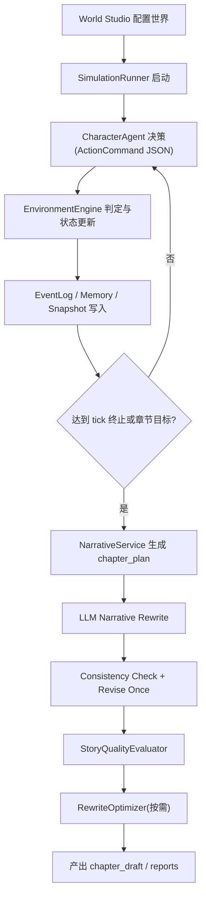

# 小说沙盘引擎 (Novel Sandbox Engine) V1 正式版

> 一个基于 AI Agent 的长篇小说自动生成引擎，支持多角色交互、剧情推演、质量评估与成稿导出。

## 🚀 快速启动

### 方式一：双击启动（推荐）

双击 `启动.bat` 文件即可一键启动前后端服务。

### 方式二：Python 启动（开发者推荐）

```bash
python launcher.py
```

### 方式三：PowerShell 启动

```powershell
.\start.ps1
```

## 📋 服务说明

启动后将运行两个服务：

| 服务 | 端口 | 地址 | 说明 |
|------|------|------|------|
| 后端 API | 8421 | http://localhost:8421 | FastAPI 服务器 |
| 前端 Web | 4242 | http://localhost:4242 | Vue3 + Vite 开发服务器 |

### API 文档

- **Swagger UI**: http://localhost:8421/docs
- **ReDoc**: http://localhost:8421/redoc

## 📦 环境准备

### 1. 环境要求

- **Python**: 3.10+
- **Node.js**: 16+

### 2. 配置 API Key

设置环境变量（或创建 `.env` 文件）：

```bash
OPENAI_API_KEY=your_api_key_here
# 可选配置
OPENAI_BASE_URL=https://api.openai.com/v1
OPENAI_MODEL=gpt-4
```

### 3. 安装依赖（首次运行自动执行）

Python 依赖：
```bash
pip install -r requirements.txt
```

前端依赖：
```bash
cd web
npm install
```

## 🎯 核心功能

### 模拟与事实引擎
- **多角色 Agent 决策**：scripted / heuristic / llm 三种模式
- **动作校验与环境裁判**：自动判定角色行为合理性
- **事件日志与状态快照**：每 tick 记录完整状态
- **导演干预系统**：张力监控、剧情阶段控制
- **剧情弧服务**：阶段锁定与推进

### 叙事与一致性
- **章节计划生成**：Rule-based 智能规划
- **LLM 正文改写**：支持回退 rule-based
- **一致性检查**：Rule + LLM 双重校验，支持自动修订
- **故事质量评估**：通用 + 类型专项双维度评分
- **自动修稿优化**：基于质量报告的智能改写

### 长篇控制与闭环
- **悬念债务管理**：OpenThread 追踪与收束
- **全书蓝图调度**：NovelBlueprint + Orchestrator
- **悬疑逻辑增强**：Evidence / TruthChain / RedHerring / Fairness
- **长跑测试**：LongRunTestRunner 稳定性验证
- **终局收束检查**：FinalClosureChecker
- **成稿导出**：ManuscriptExporter 完整稿件导出

### 可观测性
- `run_manifest / run_status / run_index` 运行索引
- `state_snapshots` 每 tick 状态快照
- `errors.jsonl` 错误上下文追踪
- `llm_traces.jsonl / llm_summary.json` LLM 调用追踪
- `metrics.json / tuning_report.md` 性能与调优报告

## 🔧 运行方式

### 方式一：前端界面（推荐）

1. 启动服务后访问：http://localhost:4242
2. 在"总览"页面点击"开始模拟"
3. 选择世界配置并运行

### 方式二：CLI 命令行

```bash
# 标准运行（V1 正式版默认链路）
python -m app.cli --world dark_city_001 --mode llm --v2-phase v2.3

# 指定目标章节数
python -m app.cli --world dark_city_001 --mode llm --target-chapters 10
```

### 方式三：API 调用

```bash
POST /api/simulations/run
{
  "world_id": "dark_city_001",
  "mode": "heuristic",
  "seed": 12345,
  "genre_id": "horror",
  "target_chapters": 10,
  "chapter_no": 1
}
```

## 📁 项目结构

```
ai-noval-world/
├── 🚀 启动.bat              # 一键启动脚本
├── 🚀 launcher.py           # Python 启动脚本
├── 🚀 start.ps1            # PowerShell 启动脚本
├── 📖 README.md            # 项目说明文档
├── 📖 启动说明.md          # 详细启动指南
├── requirements.txt        # Python 依赖
├── app/                    # 核心代码
│   ├── cli.py             # CLI 入口
│   ├── models/            # 数据模型
│   ├── services/          # 业务服务
│   │   ├── character_agent_service.py    # 角色 Agent
│   │   ├── environment_engine.py         # 环境引擎
│   │   ├── narrative_service.py          # 叙事服务
│   │   ├── consistency_service.py        # 一致性检查
│   │   ├── director_service.py           # 导演服务
│   │   ├── plot_arc_service.py           # 剧情弧服务
│   │   ├── memory_service.py             # 记忆服务
│   │   ├── chapter_continuity_service.py # 章节连续性
│   │   ├── intervention_service.py       # 干预服务
│   │   └── ...
│   ├── quality/           # 质量评估器
│   ├── genre/             # 类型抽象层
│   ├── genre_packs/       # 类型包
│   │   ├── generic/       # 通用类型
│   │   └── horror/        # 恐怖类型
│   └── runner/            # 模拟运行器
├── api/                    # API 服务器
│   └── server.py
├── web/                    # 前端项目 (Vue3 + Vite)
├── worlds/                 # 世界配置目录
├── outputs/                # 输出目录（模拟结果）
└── docs/                   # 开发文档
```

## 📊 标准输出目录

单次模拟运行结果位于 `outputs/sim_xxx/`：

1. `run_manifest.json` - 运行清单
2. `run_status.json` - 运行状态
3. `run_index.json` - 运行索引
4. `state.json` - 最终状态
5. `state_snapshots/` - 每 tick 状态快照
6. `events.jsonl` - 事件日志
7. `memories.jsonl` - 角色记忆
8. `chapter_plan.json` - 章节计划
9. `chapter_draft.md` - 章节正文草稿
10. `consistency_report.json` - 一致性检查报告
11. `quality_reports/` - 质量评估报告
12. `rewrite_reports/` - 改写报告
13. `llm_traces.jsonl` - LLM 调用追踪
14. `llm_summary.json` - LLM 调用摘要
15. `metrics.json` - 性能指标
16. `tuning_report.md` - 调优报告
17. `errors.jsonl` - 错误日志
18. `v2_phase_report.json` - V2 阶段报告

## 🎮 端到端主流程



## ⚙️ 配置说明

### 世界配置

世界配置文件位于 `worlds/` 目录，包含：
- `world_bible.json` - 世界设定
- `characters.json` - 角色设定
- `map.json` - 地图与地点连通关系
- `clues.json` - 线索与发现路由
- `chapter_goal.json` - 章节目标

### 运行模式

V1 正式版默认链路：`llm + v2.3`
- ✅ move: 开启（角色移动）
- ✅ memory: 开启（角色记忆）
- ✅ LLM rewrite: 开启（LLM 正文改写）
- ✅ consistency revise: 开启（一致性检查与自动修订）

## 🛠️ 故障排除

### 端口被占用

修改端口配置：
- 后端：`api/server.py` 中的 `port=8421`
- 前端：`web/vite.config.js` 中的 `server.port`

### 前端启动失败

```bash
cd web
rm -rf node_modules package-lock.json
npm install
npm run dev
```

### 后端导入错误

确保 `PYTHONPATH` 包含项目根目录：
```bash
set PYTHONPATH=%CD%
python -m uvicorn api.server:app --port 8421
```

### 依赖安装失败

```bash
# 升级 pip
python -m pip install --upgrade pip

# 重新安装
pip install -r requirements.txt
```

## ✨ 项目特色

1. **模块化架构** - 核心引擎与类型包分离，易于扩展
2. **质量闭环** - 自动评估 + 修稿建议，持续优化
3. **多类型支持** - 从恐怖灵异开始，逐步扩展更多类型
4. **一键启动** - 零配置启动开发环境
5. **完整可观测性** - 全链路追踪，问题定位清晰
6. **长篇能力** - 悬念管理、逻辑闭环、终局收束

## 📞 获取帮助

- 查看 API 文档：http://localhost:8421/docs
- 访问前端界面：http://localhost:4242
- 查看详细启动说明：`启动说明.md`
- 查看统一开发文档：`docs/V1正式版-统一文档.md`

祝你创作愉快！ 🎉
