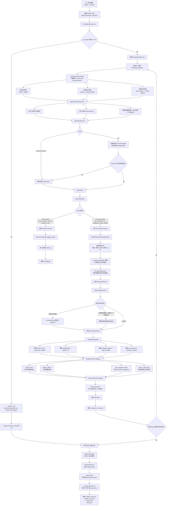
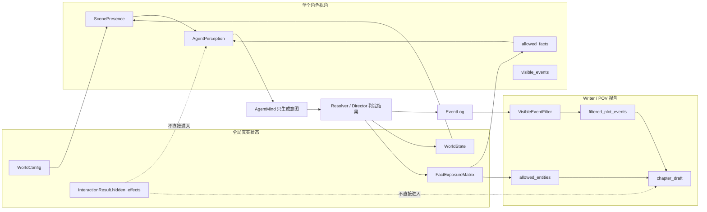
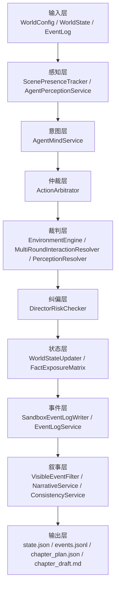

# Agent Sandbox v2.4 完整流程图

## 数据边界图

## 核心职责分层

## 关键不变量

- Agent 只决定意图，不决定交互结果。
- Resolver / EnvironmentEngine 才能裁判行为是否成功、信息是否暴露、关系如何变化。
- `known_by` 表示确认知道，`suspected_by` 表示怀疑，不可混用。
- `hidden_effects` 可以保存内部真实后果，但不能直接进入 Writer 可见输入。
- Writer 只能消费 POV 可见事件和 allowed facts，不能凭空创造剧情事实。
- Prompt / policy / writer 规则从模板或世界配置加载，不写死具体剧情信息。
