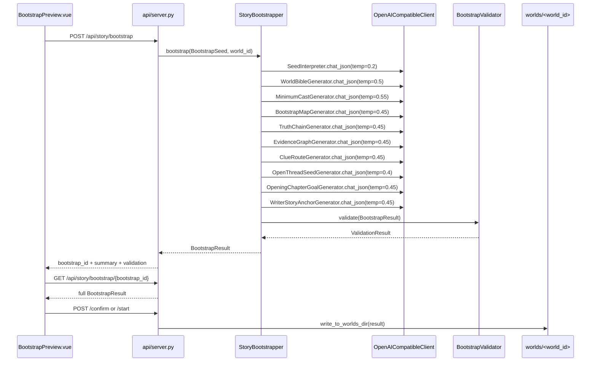
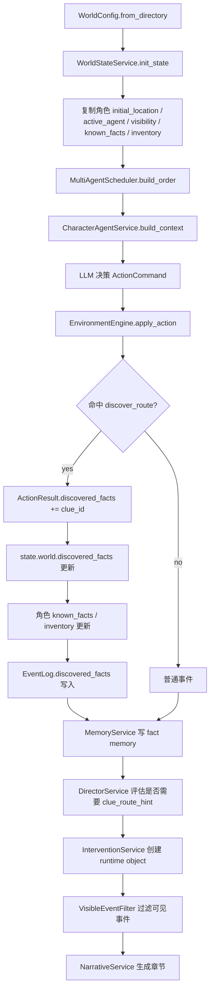

# V1 Auto Bootstrap 主流程文档

## 1. 目标

V1 Auto Bootstrap 的目标是把用户的一句话模糊设定，自动补全为一个可运行、可校验、可预览、可确认写盘并可直接启动多角色沙盘模拟的完整故事世界。

主流程必须满足：

- 从 `user_seed` 解析出题材、核心地点、异常元素、主角目标、故事类型、角色结构等结构化 seed。
- 基于 seed/worldbuilding 生成完整候选世界，而不是套用固定故事走线。
- 信息不足时优先由 LLM 自我补全；规则 fallback 只能生成抽象、seed-derived 的可运行骨架。
- 候选世界必须包含：世界观、最小角色组、地图、线索、真相链、证据图、开放悬念、第一章计划、叙事锚点。
- 通过 `BootstrapValidator` 后才能确认写入 `worlds/<world_id>/`。
- 写盘后的 world 必须能被 `WorldConfig.from_directory()` 读取并被 `SimulationRunner` 运行。
- 运行时必须支持多角色调度、线索发现、事件记忆、hidden actor 可见性过滤、章节生成。
- 前端确认前必须展示完整候选详情，而不仅是统计数字。

## 2. 核心约束

### 2.1 内容生成约束

- 不允许把具体故事内容写死为固定医院、固定旧案、固定人名、固定十年前事故、固定亲属失踪真相。
- 稳定 id 可以保留用于运行时兼容，例如 `location_gate`、`obj_gate_lock`、`clue_new_lock_core`。
- id 对应的名称、描述、动机、线索含义必须来自 seed/worldbuilding/LLM 补全。
- 负面提示可以列出禁止复用的旧内容，但不能作为正向生成模板。

### 2.2 可运行性约束

- 至少 1 个 active protagonist。
- 至少 2 个 visible active NPC。
- 至少 1 个 hidden active actor。
- 至少 5 个 location。
- 第一章至少 3 个可发现 clue。
- 每个 discover_route 必须指向真实 location；如包含 object_id，该 object 必须属于 route.location_id。
- chapter_goal.pov 必须指向真实角色。
- active 角色初始地点必须存在。
- hidden actor 直接行动不能泄露给 POV 正文，只能通过痕迹/环境事件间接体现。

## 3. 端到端流程图

```mermaid
flowchart TD
    A[前端输入 user_seed / genre / target_words / world_id] --> B[POST /api/story/bootstrap]
    B --> C[StoryBootstrapper.bootstrap]

    C --> D[SeedInterpreter 解析 ParsedSeed]
    D --> E[WorldBibleGenerator 生成 world_bible]
    E --> F[MinimumCastGenerator 生成 characters]
    F --> G[BootstrapMapGenerator 生成 map + objects]
    G --> H[TruthChainGenerator 生成 truth_chain]
    H --> I[EvidenceGraphGenerator 生成 evidence_graph]
    I --> J[ClueRouteGenerator 生成 clues + discover_routes]
    J --> K[OpenThreadSeedGenerator 生成 open_threads]
    K --> L[OpeningChapterGoalGenerator 生成 opening_chapter_plan]
    L --> M[WriterStoryAnchorGenerator 生成 writer_story_anchors]
    M --> N[BootstrapValidator.validate]

    N --> O{validation.passed?}
    O -- no --> P[返回 validation_failed 候选]
    O -- yes --> Q[返回 validated 候选摘要]

    Q --> R[前端 GET /api/story/bootstrap/{bootstrap_id}]
    R --> S[展示完整候选预览]
    S --> T{用户确认?}

    T -- confirm --> U[POST /api/story/bootstrap/{id}/confirm]
    U --> V[write_to_worlds_dir 写入 world 文件]
    V --> W[worlds/<world_id>/bootstrap_result.json]

    T -- start --> X[POST /api/story/bootstrap/{id}/start]
    X --> V
    V --> Y[run_simulation]
    Y --> Z[SimulationRunner]
    Z --> AA[WorldStateService.init_state]
    AA --> AB[MultiAgentScheduler 多角色行动]
    AB --> AC[EnvironmentEngine 应用行动]
    AC --> AD[Clue discovery / EventLog.discovered_facts]
    AD --> AE[MemoryService 记忆事实]
    AE --> AF[VisibleEventFilter 过滤 hidden actor]
    AF --> AG[NarrativeService 生成章节草稿]
    AG --> AH[outputs/sim_*]
```

## 4. Bootstrap 子流程



## 5. 运行时子流程



## 6. API 接口文档

### 6.1 `POST /api/story/bootstrap`

生成一个 bootstrap 候选，不直接覆盖现有 world，除非 `auto_confirm=true` 且校验通过。

Request:

```json
{
  "user_seed": "废弃医院，午夜出现五楼，主角调查失踪妹妹",
  "target_genre": "horror_suspense",
  "target_words": 100000,
  "auto_confirm": false,
  "world_id": "world_optional_id"
}
```

字段含义：

| 字段 | 类型 | 必填 | 含义 |
| --- | --- | --- | --- |
| `user_seed` | string | 是 | 用户的一句话模糊故事设定。 |
| `target_genre` | string | 否 | 目标题材，默认 `horror_suspense`。 |
| `target_words` | int | 否 | 目标总字数，默认 `100000`。 |
| `auto_confirm` | bool | 否 | 校验通过后是否自动写入 `worlds/<world_id>/`。 |
| `world_id` | string/null | 否 | 指定 world id；为空时自动生成。 |

Response:

```json
{
  "bootstrap_id": "boot_1710000000000",
  "world_id": "world_auto_1710000000",
  "status": "validated",
  "title": "旧医院回声",
  "summary": {
    "title": "旧医院回声",
    "characters": 5,
    "locations": 7,
    "clues": 4,
    "open_threads": 4
  },
  "validation": {
    "passed": true,
    "issues": [],
    "warnings": []
  }
}
```

### 6.2 `GET /api/story/bootstrap/{bootstrap_id}`

获取完整候选详情。优先读内存候选；内存缺失时扫描 `worlds/*/bootstrap_result.json`；仍缺失时 fallback 到 `bootstrap_manifest.json`。

Response 是完整 `BootstrapResult`：

```json
{
  "bootstrap_id": "boot_...",
  "world_id": "world_auto_...",
  "status": "validated",
  "title": "...",
  "world_bible": {},
  "characters": [],
  "map": [],
  "clues": [],
  "truth_chain": {},
  "evidence_graph": [],
  "open_threads": [],
  "opening_chapter_plan": {},
  "writer_story_anchors": {},
  "chapter_goal": {},
  "parsed_seed": {},
  "validation": {}
}
```

### 6.3 `POST /api/story/bootstrap/{bootstrap_id}/confirm`

确认候选并写入 `worlds/<world_id>/`。

成功响应：

```json
{
  "success": true,
  "world_id": "world_auto_...",
  "world_dir": ".../worlds/world_auto_...",
  "summary": {
    "title": "...",
    "characters": 5,
    "locations": 7,
    "clues": 4,
    "open_threads": 4
  }
}
```

失败条件：

- `bootstrap_id` 不存在：404。
- `validation.passed=false`：400，并返回 issues。

### 6.4 `POST /api/story/bootstrap/{bootstrap_id}/start`

确认候选、写盘并启动一次模拟。

成功响应复用 `/api/simulations/run`：

```json
{
  "success": true,
  "sim_id": "sim_1710000000000",
  "message": "模拟已启动，请等待完成"
}
```

失败条件：

- `bootstrap_id` 不存在：404。
- 校验失败：400。
- LLM 未配置：400。

### 6.5 `POST /api/simulations/run`

对已存在 world 启动模拟。

Request:

```json
{
  "world_id": "world_auto_...",
  "mode": "llm",
  "v2_phase": "v2.4",
  "ticks": null,
  "seed": 12345,
  "genre_id": "horror",
  "target_chapters": 10,
  "chapter_no": 1
}
```

说明：当前服务端会强制使用 `mode=llm`、`v2_phase=v2.4`。

### 6.6 `GET /api/simulations/{sim_id}/status`

查询后台模拟状态。

Response:

```json
{
  "status": "running|completed|failed",
  "request": {},
  "error": null,
  "simulation_id": "sim_...",
  "runtime_mode": "llm",
  "runtime_phase": "v2.4"
}
```

### 6.7 `GET /api/simulations/{sim_id}`

读取模拟产物，包括 `state.json`、`chapter_draft.md`、`chapter_plan.json`。

### 6.8 `GET /api/worlds` / `GET /api/worlds/{world_id}`

列出或读取已写盘 world。

## 7. 写盘文件契约

`StoryBootstrapper.write_to_worlds_dir()` 必须写出：

| 文件 | 作用 |
| --- | --- |
| `world_bible.json` | 世界观，兼容 `WorldBible`。 |
| `characters.json` | 角色配置，保留 active/hidden/runtime 字段。 |
| `map.json` | 地图、对象和连接。 |
| `clues.json` | 线索、discover_routes、on_discovered、bootstrap 扩展字段。 |
| `chapter_goal.json` | 第一章运行目标和 POV。 |
| `writer_story_anchors.json` | 章节叙事锚点。 |
| `truth_chain.json` | 真相递进与禁止提前揭露信息。 |
| `evidence_graph.json` | 证据图。 |
| `open_threads.json` | 开放悬念池。 |
| `opening_chapter_plan.json` | 第一章计划。 |
| `bootstrap_result.json` | 完整候选，支持服务重启后恢复。 |
| `bootstrap_manifest.json` | 摘要审计信息。 |

## 8. LLM 调用点、参数与含义

### 8.1 Bootstrap 生成阶段

| 调用点 | 方法 | temperature | 输入核心 | 输出 | 含义 |
| --- | --- | ---: | --- | --- | --- |
| `SeedInterpreter._interpret_with_llm` | `chat_json` | 0.2 | `user_seed` | `ParsedSeed` | 低随机性解析结构化 seed，尽量忠实用户输入。 |
| `WorldBibleGenerator._generate_with_llm` | `chat_json` | 0.5 | `ParsedSeed` + template + world_id | `world_bible` | 补全世界观、规则、主题、时间线。 |
| `MinimumCastGenerator._generate_with_llm` | `chat_json` | 0.55 | `ParsedSeed` + gate location | `CharacterWithAgent[]` | 生成最小可运行角色组，支持群像生存和 hidden actor。 |
| `BootstrapMapGenerator._generate_with_llm` | `chat_json` | 0.45 | `ParsedSeed` | `BootstrapLocation[]` | 生成最小可运行地图和对象。 |
| `TruthChainGenerator._generate_with_llm` | `chat_json` | 0.45 | `ParsedSeed` | `TruthChain` | 生成最终真相与逐阶段揭露限制。 |
| `EvidenceGraphGenerator._generate_with_llm` | `chat_json` | 0.45 | `ParsedSeed` | `EvidenceItem[]` | 生成可交叉验证的证据图。 |
| `ClueRouteGenerator._generate_with_llm` | `chat_json` | 0.45 | `ParsedSeed` | `BootstrapClue[]` | 生成线索、发现入口、发现后效果。 |
| `OpenThreadSeedGenerator._generate_with_llm` | `chat_json` | 0.4 | `ParsedSeed` | `OpenThread[]` | 生成第一章可持续推进的悬念池。 |
| `OpeningChapterGoalGenerator._generate_with_llm` | `chat_json` | 0.45 | `ParsedSeed` + protagonist_name | `OpeningChapterPlan` | 生成第一章目标、事件、障碍、禁止揭露。 |
| `WriterStoryAnchorGenerator._generate_with_llm` | `chat_json` | 0.45 | title + `ParsedSeed` + opening + protagonist | `WriterStoryAnchor` | 给章节写作提供非泛化锚点。 |

### 8.2 运行时阶段

| 调用点 | 方法 | temperature | 输入核心 | 输出 | 含义 |
| --- | --- | ---: | --- | --- | --- |
| `CharacterAgentService` | `chat_json` | 由角色/服务配置控制 | `AgentContext`、可见状态、known_facts、inventory、目标 | `ActionCommand` | 为角色选择下一步行动。 |
| `NarrativeService` | `chat` | 0.7 | 可见事件、world/character anchors、章节目标 | 章节正文 | 将沙盘事件转成章节草稿。 |
| `ConsistencyCheck` | `chat_json` | 0.0/0.2 | 章节草稿 + 约束 | 检查/修订建议 | 检查一致性并可生成修订。 |
| `ConsistencyService` | `chat_json/chat` | 0.0/0.2 | 章节草稿 + 世界事实 | 检查/修订文本 | 运行时叙事一致性保障。 |
| `LLMCharacterGenerator` | `chat_json` | 由服务配置控制 | world_id、count、genre | 角色候选 | 非 bootstrap 的角色候选生成接口。 |

## 9. 前端页面契约

`web/src/views/BootstrapPreview.vue` 必须：

- 允许输入 `user_seed`、`target_genre`、`target_words`、可选 `world_id`。
- `POST /api/story/bootstrap` 成功后立即 `GET /api/story/bootstrap/{bootstrap_id}` 拉取完整候选。
- 展示 summary：标题、角色数、地点数、线索数、状态。
- 展示 validation issues/warnings。
- 展示完整候选详情：world bible、opening plan、characters、locations/objects、clues/discover_routes、truth chain、evidence graph、open threads、writer anchors。
- 只有 `validation.passed=true` 时允许 confirm/start。

## 10. 排查清单

### 10.1 Bootstrap 生成

- [ ] LLM 调用是否统一使用正确签名 `chat_json(system=..., user=..., temperature=...)`。
- [ ] fallback 是否仍存在固定具体故事走线。
- [ ] 群像生存 seed 是否能生成多个 visible active 同场角色。
- [ ] `BootstrapResult` 是否包含所有必要字段。

### 10.2 Validator

- [ ] 是否检查 protagonist、visible active NPC、hidden actor。
- [ ] 是否检查 location/object/route cross-reference。
- [ ] 是否检查 opening selected clues 至少 3 个可发现线索。
- [ ] 是否检查 writer anchors / truth chain / evidence graph。

### 10.3 写盘与恢复

- [ ] 是否写出 `bootstrap_result.json`。
- [ ] confirm/start 写盘前是否设置 `status=confirmed`。
- [ ] 服务重启后 GET/confirm/start 是否可从磁盘恢复。
- [ ] 写出的 world 是否可被 `WorldConfig.from_directory()` 加载。

### 10.4 运行时

- [ ] `CharacterProfile` 是否保留 bootstrap/runtime 字段。
- [ ] `WorldStateService.init_state()` 是否使用 `initial_location`、`known_facts`、`inventory`。
- [ ] `EnvironmentEngine` 是否校验 route.location_id。
- [ ] 线索发现是否写入 `ActionResult.discovered_facts` 与 `EventLog.discovered_facts`。
- [ ] `MemoryService` 是否优先使用 `event.discovered_facts`。
- [ ] `VisibleEventFilter` 是否不会泄露 hidden direct event。
- [ ] `DirectorService` 的 clue_route_hint 是否创建真实 runtime object，而不是直接标记发现。

### 10.5 前端

- [ ] 是否展示完整候选而非仅摘要。
- [ ] confirm/start 按钮是否受 validation 控制。
- [ ] 错误提示是否能展示后端 validation issues。

## 11. 验证命令

```bash
python -m compileall -q "novel-sim-v1/app/bootstrap" "novel-sim-v1/app/services" "novel-sim-v1/api"
python "novel-sim-v1/test_bootstrap_integration.py"
python "novel-sim-v1/test_p1_integration.py"
```

手动验证：

1. 启动后端。
2. 启动前端。
3. 在 Story Bootstrap 页面输入：`噩梦医院，几个人一起醒来，必须在天亮前找到出口活下去`。
4. 确认候选包含至少 3 个 visible active 同场角色和 1 个 hidden actor。
5. 点击确认并写盘。
6. 点击确认 + 启动模拟。
7. 检查 `outputs/sim_*` 中事件、状态和章节草稿。

## 12. 验收标准

- 一句话 seed 能生成通过校验的完整候选。
- 候选可预览、可确认、可写盘、可运行。
- 写盘 world 可重启恢复。
- 线索发现链路可追踪到 clue id。
- hidden actor 不直接泄露给 POV 正文。
- 前端可展示完整候选详情。
- 所有生成内容都从 seed/worldbuilding/LLM 补全，不依赖固定故事模板。
