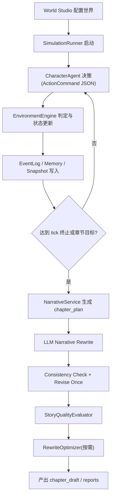
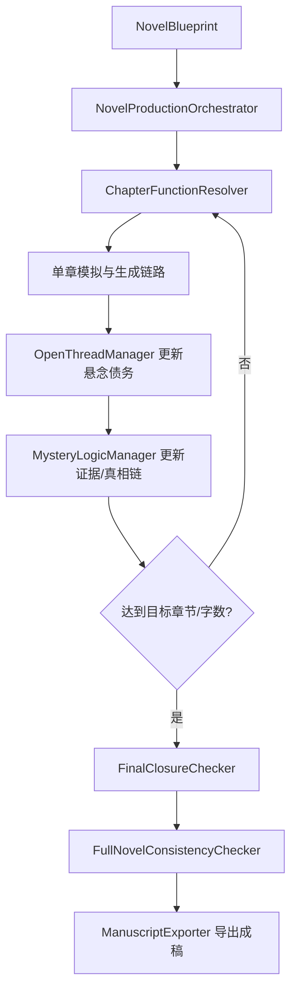
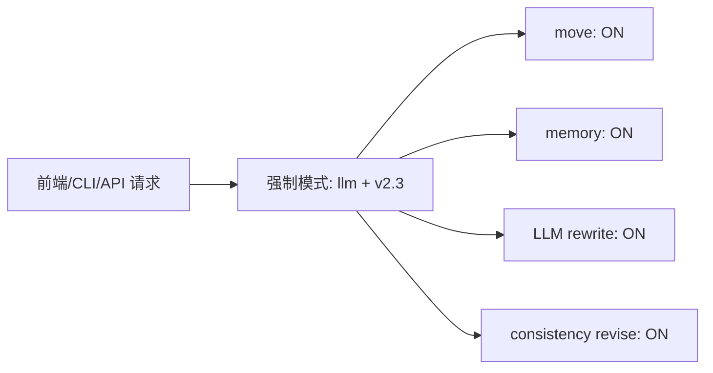

# 小说沙盘引擎 V1 正式版统一文档

> 版本：V1 正式版  
> 日期：2026-05-19  
> 目标：将 `docs/` 内分散的 V1～V5.7 规划与当前实现统一为一份可执行说明文档

---

## 1. 版本定义

V1 正式版采用“能力整合口径”：

1. 以 `NOVEL_SANDBOX_V1_BETA_OVERVIEW` 作为总目标框架。
2. 吸收 V2/V3/V4/V5 中已落地能力，形成单一可运行链路。
3. 最终默认运行模式：`llm + v2.3`
   - 开 `move`
   - 开 `memory`
   - 开 `LLM Narrative Rewrite`
   - 开 `Consistency Check + Revise Once`

---

## 2. 已有功能清单（当前代码）

### 2.1 世界与配置层

1. 世界配置加载：`world_bible / characters / map / clues / chapter_goal`
2. 多地点地图与连通关系（`connected_to`）
3. 线索发现路由（`discover_routes`）与阶段限制
4. API 世界管理与世界创建

对应实现：
- `app/models/world.py`
- `app/services/world_config_service.py`
- `api/server.py`

### 2.2 模拟与事实引擎

1. 角色 Agent 决策：`scripted / heuristic / llm`
2. 动作校验与环境裁判（含 `move`）
3. 事件日志写入（raw + plot）
4. 状态推进与每 tick 快照
5. 导演干预、张力监控、剧情阶段控制

对应实现：
- `app/services/character_agent_service.py`
- `app/services/action_validator.py`
- `app/services/environment_engine.py`
- `app/services/event_log_service.py`
- `app/services/progress_monitor.py`
- `app/services/director_service.py`
- `app/services/intervention_service.py`
- `app/services/plot_arc_service.py`
- `app/runner/simulation_runner.py`

### 2.3 叙事与一致性

1. 章节计划生成（Rule-based chapter plan）
2. LLM 正文改写（可回退 rule-based）
3. 一致性检查（Rule + LLM）与一次自动修订
4. 质量评估（StoryQualityEvaluator）
5. 自动修稿器（RewriteOptimizer）

对应实现：
- `app/services/narrative_service.py`
- `app/services/consistency_service.py`
- `app/quality/story_quality_evaluator_service.py`
- `app/services/rewrite_optimizer.py`

### 2.4 长篇控制与闭环模块

1. 悬念债务管理（OpenThreadManager）
2. 全书蓝图与生产调度（NovelBlueprint + Orchestrator）
3. 悬疑逻辑增强（Evidence / TruthChain / RedHerring / Fairness）
4. 长跑测试（LongRunTestRunner）
5. 终局收束检查（FinalClosureChecker）
6. 成稿导出（ManuscriptExporter）

对应实现：
- `app/services/open_thread_manager.py`
- `app/models/blueprint.py`
- `app/services/novel_production_orchestrator.py`
- `app/services/mystery_logic_manager.py`
- `app/services/long_run_test_runner.py`

### 2.5 可观测性与运行产物

1. `run_manifest / run_status / run_index`
2. `state_snapshots` 每 tick 快照
3. `errors.jsonl` 与失败上下文
4. `llm_traces.jsonl / llm_summary.json`
5. `metrics.json / tuning_report.md`

对应实现：
- `app/services/run_manager_lite.py`
- `app/services/trace_service.py`

### 2.6 前后端运行入口

1. CLI 运行入口：`app.cli`
2. API 运行入口：`/api/simulations/run`
3. 前端总览页一键触发模拟
4. 默认链路强制为 `llm + v2.3`

对应实现：
- `app/cli.py`
- `api/server.py`
- `web/src/views/Overview.vue`

---

## 3. 标准流程图（V1 正式版）

### 3.1 端到端主流程



### 3.2 长篇生产闭环



### 3.3 运行模式流程（固定最终版）



---

## 4. 标准输出目录（单次 run）

典型目录：`outputs/sim_xxx/`

1. `run_manifest.json`
2. `run_status.json`
3. `run_index.json`
4. `state.json`
5. `state_snapshots/`
6. `events.jsonl`
7. `memories.jsonl`
8. `chapter_plan.json`
9. `chapter_draft.md`
10. `consistency_report.json`
11. `quality_reports/`
12. `rewrite_reports/`
13. `llm_traces.jsonl`
14. `llm_summary.json`
15. `metrics.json`
16. `tuning_report.md`
17. `errors.jsonl`
18. `v2_phase_report.json`

---

## 5. V1 正式版最小运行步骤

1. 配置环境变量：`OPENAI_API_KEY`（以及可选 `OPENAI_BASE_URL`、`OPENAI_MODEL`）
2. 选择或创建世界（至少具备：角色、地点、线索、章节目标）
3. 通过以下任一入口运行：
   - CLI：`python -m app.cli --world dark_city_001 --mode llm --v2-phase v2.3`
   - API：`POST /api/simulations/run`
   - 前端：总览页“开始模拟”
4. 检查 `outputs/sim_xxx/` 产物与报告

---

## 6. V1 验收口径（正式版）

### 6.1 必过项

1. 能完成一次端到端运行（事件、章节、报告完整落盘）
2. `move` 可用且状态变化正确
3. `memory` 持续写入并可用于 Agent 上下文
4. LLM 叙事可生成正文并写入 `chapter_draft.md`
5. 一致性检查可输出报告，违规时可自动修订一次

### 6.2 长篇能力项（阶段验收）

1. OpenThread 管理可输出债务报告
2. MysteryLogic 能维护证据/真相链核心状态
3. LongRun 可产出测试报告
4. FinalClosure + 全书一致性检查可执行
5. ManuscriptExporter 可导出完整稿件

---

## 7. P0 可靠性与验证阻断机制

### 7.1 目标

P0 机制用于避免章节生成、质量评估或一致性检查存在问题时，运行结果仍被误标记为干净完成。

核心原则：

1. 章节生成可以完成并落盘。
2. 验证流程独立判断本次结果是否可靠。
3. 如果验证失败或存在警告，`run_status.json.status` 不写成干净的 `completed`，而写成 `completed_with_validation_errors`。
4. 验证失败同步写入 `run_status.json`、`metrics.json`、`tuning_report.md`、`run_index.json`。

### 7.2 总体流程

```text
SimulationRunner.run()
  ├─ 初始化 RunManagerLite
  ├─ 执行沙盘 tick loop
  ├─ 保存 state / events / plot_arc_state
  ├─ NarrativeService.generate_chapter()
  │    ├─ 生成 chapter_plan.json
  │    ├─ 写入 writer_structured_context
  │    ├─ 写入 writer_authorization
  │    ├─ 生成 chapter_draft.md
  │    ├─ 写入 consistency_report.json
  │    ├─ 写入 chapter_debug.json
  │    └─ 写入 draft_faithfulness_report.json
  ├─ StoryQualityEvaluatorService.evaluate()
  │    └─ 写入 quality_reports/ch_001_quality.json
  ├─ 执行 P0 validators
  │    ├─ ArtifactConsistencyValidator
  │    ├─ EncodingHealthChecker
  │    ├─ ChapterGoalCompletionChecker
  │    ├─ DraftFaithfulnessChecker 结果复用
  │    └─ Quality report adapter
  ├─ 聚合 validation_summary.json
  ├─ 写入 v2_phase_report.json
  └─ RunManagerLite.complete_with_validation()
       ├─ 写入 run_status.json
       ├─ 写入 metrics.json
       ├─ 写入 tuning_report.md
       └─ 写入 run_index.json
```

### 7.3 验证状态规则

| 条件 | validation_status |
|---|---|
| 无问题 | `passed` |
| 只有 medium / low 问题 | `warning` |
| 有 high / critical 问题 | `failed` |

| validation_status | run_status.status | last_error |
|---|---|---|
| `passed` | `completed` | `null` |
| `warning` | `completed_with_validation_errors` | `Validation warnings` |
| `failed` | `completed_with_validation_errors` | `Validation failed` |

### 7.4 新增或升级的服务

| 服务 | 文件 | 作用 |
|---|---|---|
| ArtifactConsistencyValidator | `app/services/artifact_consistency_validator.py` | 检查核心运行 artifact 是否互相一致 |
| EncodingHealthChecker | `app/services/encoding_health_checker.py` | 检查章节计划、debug、报告中的乱码 marker |
| WriterAuthorizationBuilder | `app/services/writer_authorization_builder.py` | 为 Writer 构建授权边界 |
| DraftFaithfulnessChecker | `app/services/draft_faithfulness_checker.py` | 检查正文是否越权新增剧情事实、线索、地点或关系变化 |
| ChapterGoalCompletionChecker | `app/services/chapter_goal_completion_checker.py` | 输出章节目标 checklist 初检报告 |

### 7.5 标准输出新增 artifact

单次运行目录 `outputs/sim_xxx/` 新增或升级以下产物：

1. `validation_summary.json`
2. `artifact_consistency_report.json`
3. `encoding_health_report.json`
4. `draft_faithfulness_report.json`
5. `chapter_goal_completion_report.json`
6. `chapter_plan.json.writer_structured_context.writer_authorization`
7. `run_status.json.generation_status`
8. `run_status.json.validation_status`
9. `run_status.json.validation_errors`
10. `metrics.json.validation`
11. `tuning_report.md` 的 Validation 段
12. `run_index.json.artifacts` 中的验证报告索引

### 7.6 `run_status.json` 字段

```json
{
  "simulation_id": "string",
  "status": "created | running | completed | completed_with_validation_errors | failed",
  "current_tick": "number",
  "current_chapter": "number",
  "last_event_id": "string | null",
  "last_error": "string | null",
  "progress": {
    "ticks_done": "number",
    "tick_limit": "number",
    "chapters_done": "number",
    "chapter_limit": "number"
  },
  "generation_status": "completed | null",
  "validation_status": "passed | warning | failed | null",
  "validation_errors": [
    {
      "source": "string",
      "type": "string",
      "severity": "low | medium | high | critical",
      "message": "string",
      "details": "object"
    }
  ]
}
```

### 7.7 `validation_summary.json` 字段

```json
{
  "validation_status": "passed | warning | failed",
  "validation_errors": [
    {
      "source": "artifact_consistency | encoding_health | draft_faithfulness | chapter_goal_completion | quality",
      "type": "string",
      "severity": "low | medium | high | critical",
      "message": "string",
      "details": "object"
    }
  ],
  "issue_count": "number",
  "high_count": "number",
  "medium_count": "number",
  "reports": {
    "artifact_consistency": {
      "status": "passed | warning | failed",
      "issue_count": "number",
      "high_count": "number",
      "medium_count": "number"
    },
    "encoding_health": {
      "status": "passed | warning | failed",
      "issue_count": "number",
      "high_count": "number",
      "medium_count": "number"
    },
    "draft_faithfulness": {
      "status": "passed | warning | failed",
      "issue_count": "number",
      "high_count": "number",
      "medium_count": "number"
    },
    "chapter_goal_completion": {
      "status": "passed | warning | failed",
      "issue_count": "number",
      "high_count": "number",
      "medium_count": "number"
    },
    "quality": {
      "status": "passed | warning | failed",
      "issue_count": "number",
      "high_count": "number",
      "medium_count": "number"
    }
  },
  "artifacts": {
    "artifact_consistency": "artifact_consistency_report.json",
    "encoding_health": "encoding_health_report.json",
    "draft_faithfulness": "draft_faithfulness_report.json",
    "chapter_goal_completion": "chapter_goal_completion_report.json"
  }
}
```

### 7.8 `artifact_consistency_report.json` 字段

```json
{
  "validator": "artifact_consistency",
  "status": "passed | warning | failed",
  "passed": "boolean",
  "issue_count": "number",
  "high_count": "number",
  "medium_count": "number",
  "issues": [
    {
      "type": "DISCOVERED_FACTS_MISMATCH | CHAPTER_PLAN_EVENT_MISSING | LLM_TRACE_SUMMARY_MISMATCH | QUALITY_REPORT_BLOCKING_ISSUE",
      "severity": "medium | high",
      "message": "string",
      "details": {
        "state_only": ["string"],
        "plot_arc_only": ["string"],
        "missing": [
          {
            "beat_id": "string",
            "event_id": "string"
          }
        ],
        "trace_count": "number",
        "total_calls": "number",
        "path": "string",
        "status": "string",
        "rewrite_priority": "string"
      }
    }
  ]
}
```

### 7.9 `encoding_health_report.json` 字段

检测 marker：`瑙`、`涓`、`绱`、`鍠`、`鎮`、`锛`、`鍙`、`鐢`、`鍒`、`搴`、`�`。

```json
{
  "checker": "encoding_health",
  "status": "passed | warning | failed",
  "passed": "boolean",
  "issue_count": "number",
  "high_count": "number",
  "medium_count": "number",
  "low_count": "number",
  "issues": [
    {
      "type": "MOJIBAKE_MARKER_DETECTED",
      "severity": "low | medium | high",
      "message": "string",
      "details": {
        "path": "string",
        "field": "string",
        "markers": ["string"]
      }
    }
  ]
}
```

### 7.10 `draft_faithfulness_report.json` 字段

```json
{
  "checker": "draft_faithfulness",
  "status": "passed | warning | failed",
  "passed": "boolean",
  "issue_count": "number",
  "high_count": "number",
  "medium_count": "number",
  "scores": {
    "entity_faithfulness": "number",
    "fact_faithfulness": "number",
    "clue_faithfulness": "number",
    "relationship_faithfulness": "number",
    "location_faithfulness": "number",
    "chronology_faithfulness": "number",
    "pov_faithfulness": "number",
    "overall": "number"
  },
  "issues": [
    {
      "type": "UNAUTHORIZED_PLOT_OBJECT | UNDISCOVERED_CLUE_LEAK | UNVISITED_LOCATION_MENTION | BACKEND_FIELD_LEAK | UNSUPPORTED_RELATIONSHIP_SHIFT",
      "severity": "medium | high",
      "message": "string",
      "details": {
        "keyword": "string",
        "sentence": "string",
        "clue_id": "string",
        "content_preview": "string",
        "location_id": "string",
        "location_name": "string",
        "field": "string"
      }
    }
  ]
}
```

### 7.11 `chapter_goal_completion_report.json` 字段

```json
{
  "checker": "chapter_goal_completion",
  "status": "passed | warning | failed",
  "passed": "boolean",
  "completed_by_state": "boolean",
  "effective_completed": "boolean",
  "checklist": {
    "required_clue_ids": ["string"],
    "required_visible_clue_ids": ["string"],
    "min_relationship_updates": "number",
    "min_key_discussions": "number"
  },
  "checks": [
    {
      "name": "STATE_COMPLETED | REQUIRED_CLUES_DISCOVERED | REQUIRED_VISIBLE_CLUES_DISCOVERED | MIN_RELATIONSHIP_UPDATES | MIN_KEY_DISCUSSIONS",
      "passed": "boolean",
      "severity": "medium | high",
      "message": "string",
      "details": "object"
    }
  ],
  "issue_count": "number",
  "high_count": "number",
  "medium_count": "number",
  "stats": {
    "discovered_clue_count": "number",
    "visible_discovered_clue_count": "number",
    "key_discussion_count": "number",
    "relationship_update_count": "number",
    "belief_count": "number",
    "stance_count": "number",
    "goal_count": "number",
    "open_thread_count": "number"
  }
}
```

### 7.12 `writer_authorization` 字段

位置：`chapter_plan.json.writer_structured_context.writer_authorization`。

```json
{
  "authorized_entities": {
    "characters": [
      {
        "id": "string",
        "name": "string"
      }
    ],
    "locations": [
      {
        "id": "string",
        "name": "string",
        "visited": "boolean"
      }
    ],
    "objects": [
      {
        "id": "string",
        "name": "string",
        "location_id": "string"
      }
    ],
    "facts": ["string"],
    "clues": [
      {
        "id": "string",
        "name": "string",
        "content": "string"
      }
    ],
    "rules": ["string"]
  },
  "atmosphere_allowed": true,
  "forbidden_fact_ids": ["string"],
  "pov_known_fact_ids": ["string"],
  "pov_visible_event_ids": ["string"],
  "pov_id": "string"
}
```

### 7.13 `metrics.json.validation` 字段

```json
{
  "validation": {
    "status": "passed | warning | failed | unknown",
    "error_count": "number",
    "errors": [
      {
        "source": "string",
        "type": "string",
        "severity": "low | medium | high | critical",
        "message": "string",
        "details": "object"
      }
    ],
    "summary": "object",
    "artifact_consistency": "object",
    "encoding_health": "object",
    "draft_faithfulness": "object",
    "chapter_goal_completion": "object"
  }
}
```

### 7.14 `tuning_report.md` Validation 段

```md
## Validation

- status: failed
- issue_count: 5
- summary: validation_summary.json
- artifact consistency: artifact_consistency_report.json
- encoding health: encoding_health_report.json
- draft faithfulness: draft_faithfulness_report.json
- chapter goal completion: chapter_goal_completion_report.json
```

### 7.15 `run_index.json` 新增索引

```json
{
  "artifacts": {
    "validation_summary.json": "validation_summary.json",
    "artifact_consistency_report.json": "artifact_consistency_report.json",
    "encoding_health_report.json": "encoding_health_report.json",
    "draft_faithfulness_report.json": "draft_faithfulness_report.json",
    "chapter_goal_completion_report.json": "chapter_goal_completion_report.json"
  }
}
```

### 7.16 问题类型汇总

| 来源 | type / check name | severity | 含义 |
|---|---|---|---|
| artifact_consistency | `DISCOVERED_FACTS_MISMATCH` | high | `state` 与 `plot_arc_state` 的已发现线索不一致 |
| artifact_consistency | `CHAPTER_PLAN_EVENT_MISSING` | high | `chapter_plan` 引用了不存在的事件 |
| artifact_consistency | `LLM_TRACE_SUMMARY_MISMATCH` | medium | LLM trace 数量与 summary 不一致 |
| artifact_consistency | `QUALITY_REPORT_BLOCKING_ISSUE` | high | 质量报告 failed 或高优先级 rewrite |
| encoding_health | `MOJIBAKE_MARKER_DETECTED` | low / medium / high | 发现乱码 marker |
| draft_faithfulness | `UNAUTHORIZED_PLOT_OBJECT` | medium / high | 正文出现未授权剧情道具 |
| draft_faithfulness | `UNDISCOVERED_CLUE_LEAK` | high | 正文泄露未发现线索 |
| draft_faithfulness | `UNVISITED_LOCATION_MENTION` | medium / high | 正文提到未访问地点 |
| draft_faithfulness | `BACKEND_FIELD_LEAK` | high | 正文泄露后端字段 |
| draft_faithfulness | `UNSUPPORTED_RELATIONSHIP_SHIFT` | medium | 无关系更新却出现关系定性变化 |
| chapter_goal_completion | `STATE_COMPLETED` | medium | state 是否认为章节目标完成 |
| chapter_goal_completion | `REQUIRED_CLUES_DISCOVERED` | high | 必需线索是否发现 |
| chapter_goal_completion | `REQUIRED_VISIBLE_CLUES_DISCOVERED` | high | 必需可见线索是否出现 |
| chapter_goal_completion | `MIN_RELATIONSHIP_UPDATES` | high | 关系变化数量是否满足 |
| chapter_goal_completion | `MIN_KEY_DISCUSSIONS` | medium | 关键讨论数量是否满足 |
| quality | `QUALITY_FAILED` | high | QA 报告 failed |
| quality | `QUALITY_REWRITE_RECOMMENDED` | medium / high | QA 建议重写 |

### 7.17 排查顺序

当 `validation_status=failed` 时，按以下顺序排查：

1. 查看 `validation_summary.json`。
2. 找到 `validation_errors[*].source`。
3. 根据 source 打开对应报告：
   - `artifact_consistency_report.json`
   - `encoding_health_report.json`
   - `draft_faithfulness_report.json`
   - `chapter_goal_completion_report.json`
   - `quality_reports/ch_001_quality.json`
4. 根据 `type` 和 `details` 定位具体原因。
5. 修复后重新运行 simulation。
6. 确认：
   - `run_status.json.validation_status`
   - `metrics.json.validation`
   - `tuning_report.md` 的 Validation 段

---

## 8. 维护规则

后续所有新增文档按以下规则处理：

1. 新计划文档可以继续分文件维护。
2. 但对外统一口径必须先更新本文件。
3. 本文件优先级高于历史拆分计划文档中的旧版本描述。

