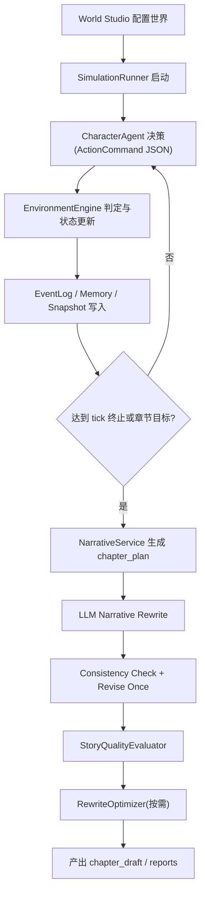
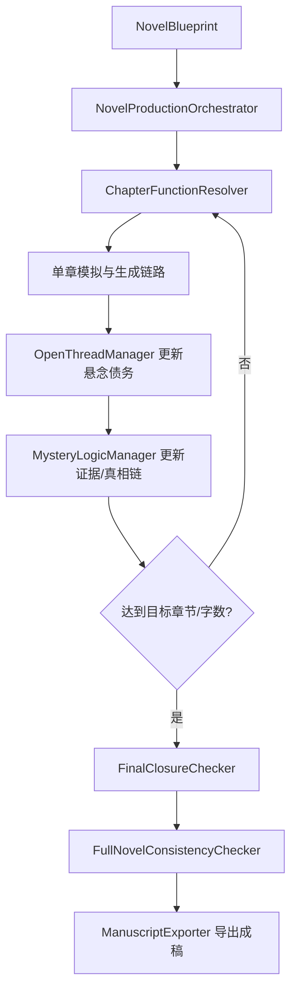
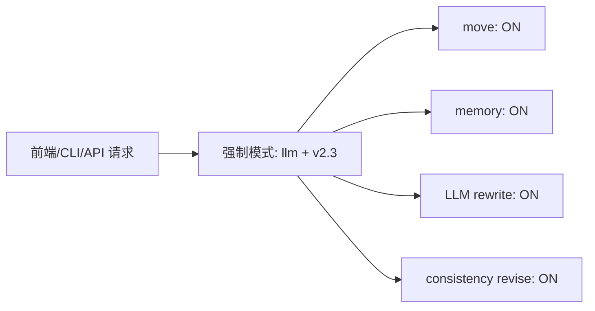

# 小说沙盘引擎 V1 正式版统一文档

> 版本：V1 正式版  
> 日期：2026-05-19  
> 目标：将 `docs/` 内分散的 V1～V5.7 规划与当前实现统一为一份可执行说明文档

---

## 1. 版本定义

V1 正式版采用“能力整合口径”：

1. 以 `NOVEL_SANDBOX_V1_BETA_OVERVIEW` 作为总目标框架。
2. 吸收 V2/V3/V4/V5 中已落地能力，形成单一可运行链路。
3. 最终默认运行模式：`llm + v2.3`
   - 开 `move`
   - 开 `memory`
   - 开 `LLM Narrative Rewrite`
   - 开 `Consistency Check + Revise Once`

---

## 2. 已有功能清单（当前代码）

### 2.1 世界与配置层

1. 世界配置加载：`world_bible / characters / map / clues / chapter_goal`
2. 多地点地图与连通关系（`connected_to`）
3. 线索发现路由（`discover_routes`）与阶段限制
4. API 世界管理与世界创建

对应实现：
- `app/models/world.py`
- `app/services/world_config_service.py`
- `api/server.py`

### 2.2 模拟与事实引擎

1. 角色 Agent 决策：`scripted / heuristic / llm`
2. 动作校验与环境裁判（含 `move`）
3. 事件日志写入（raw + plot）
4. 状态推进与每 tick 快照
5. 导演干预、张力监控、剧情阶段控制

对应实现：
- `app/services/character_agent_service.py`
- `app/services/action_validator.py`
- `app/services/environment_engine.py`
- `app/services/event_log_service.py`
- `app/services/progress_monitor.py`
- `app/services/director_service.py`
- `app/services/intervention_service.py`
- `app/services/plot_arc_service.py`
- `app/runner/simulation_runner.py`

### 2.3 叙事与一致性

1. 章节计划生成（Rule-based chapter plan）
2. LLM 正文改写（可回退 rule-based）
3. 一致性检查（Rule + LLM）与一次自动修订
4. 质量评估（StoryQualityEvaluator）
5. 自动修稿器（RewriteOptimizer）

对应实现：
- `app/services/narrative_service.py`
- `app/services/consistency_service.py`
- `app/quality/story_quality_evaluator_service.py`
- `app/services/rewrite_optimizer.py`

### 2.4 长篇控制与闭环模块

1. 悬念债务管理（OpenThreadManager）
2. 全书蓝图与生产调度（NovelBlueprint + Orchestrator）
3. 悬疑逻辑增强（Evidence / TruthChain / RedHerring / Fairness）
4. 长跑测试（LongRunTestRunner）
5. 终局收束检查（FinalClosureChecker）
6. 成稿导出（ManuscriptExporter）

对应实现：
- `app/services/open_thread_manager.py`
- `app/models/blueprint.py`
- `app/services/novel_production_orchestrator.py`
- `app/services/mystery_logic_manager.py`
- `app/services/long_run_test_runner.py`

### 2.5 可观测性与运行产物

1. `run_manifest / run_status / run_index`
2. `state_snapshots` 每 tick 快照
3. `errors.jsonl` 与失败上下文
4. `llm_traces.jsonl / llm_summary.json`
5. `metrics.json / tuning_report.md`

对应实现：
- `app/services/run_manager_lite.py`
- `app/services/trace_service.py`

### 2.6 前后端运行入口

1. CLI 运行入口：`app.cli`
2. API 运行入口：`/api/simulations/run`
3. 前端总览页一键触发模拟
4. 默认链路强制为 `llm + v2.3`

对应实现：
- `app/cli.py`
- `api/server.py`
- `web/src/views/Overview.vue`

---

## 3. 标准流程图（V1 正式版）

### 3.1 端到端主流程

### 3.2 长篇生产闭环

### 3.3 运行模式流程（固定最终版）

---

## 4. 标准输出目录（单次 run）

典型目录：`outputs/sim_xxx/`

1. `run_manifest.json`
2. `run_status.json`
3. `run_index.json`
4. `state.json`
5. `state_snapshots/`
6. `events.jsonl`
7. `memories.jsonl`
8. `chapter_plan.json`
9. `chapter_draft.md`
10. `consistency_report.json`
11. `quality_reports/`
12. `rewrite_reports/`
13. `llm_traces.jsonl`
14. `llm_summary.json`
15. `metrics.json`
16. `tuning_report.md`
17. `errors.jsonl`
18. `v2_phase_report.json`

---

## 5. V1 正式版最小运行步骤

1. 配置环境变量：`OPENAI_API_KEY`（以及可选 `OPENAI_BASE_URL`、`OPENAI_MODEL`）
2. 选择或创建世界（至少具备：角色、地点、线索、章节目标）
3. 通过以下任一入口运行：
   - CLI：`python -m app.cli --world dark_city_001 --mode llm --v2-phase v2.3`
   - API：`POST /api/simulations/run`
   - 前端：总览页“开始模拟”
4. 检查 `outputs/sim_xxx/` 产物与报告

---

## 6. V1 验收口径（正式版）

### 6.1 必过项

1. 能完成一次端到端运行（事件、章节、报告完整落盘）
2. `move` 可用且状态变化正确
3. `memory` 持续写入并可用于 Agent 上下文
4. LLM 叙事可生成正文并写入 `chapter_draft.md`
5. 一致性检查可输出报告，违规时可自动修订一次

### 6.2 长篇能力项（阶段验收）

1. OpenThread 管理可输出债务报告
2. MysteryLogic 能维护证据/真相链核心状态
3. LongRun 可产出测试报告
4. FinalClosure + 全书一致性检查可执行
5. ManuscriptExporter 可导出完整稿件

---

## 7. 维护规则

后续所有新增文档按以下规则处理：

1. 新计划文档可以继续分文件维护。
2. 但对外统一口径必须先更新本文件。
3. 本文件优先级高于历史拆分计划文档中的旧版本描述。

